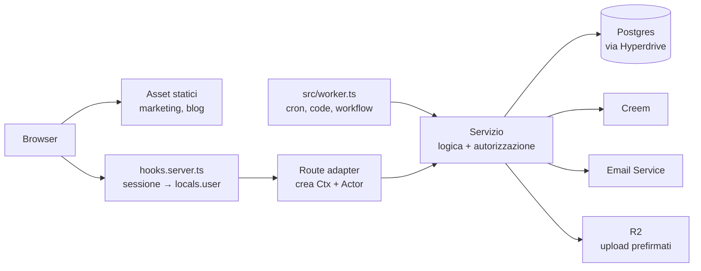

<br />
<p align="center">
    <h1>sveltekit-cf-template</h1>
    <b>Un template SaaS pronto per la produzione, con SvelteKit su Cloudflare Workers. Autenticazione, organizzazioni, pagamenti, email e test sono già fatti come si deve; il resto lo costruisce un agente IA, nel posto giusto.</b>
    <br />
    <br />
</p>

[English](README.md) | Italiano

sveltekit-cf-template è la parte di un SaaS difficile da fare bene e noiosa da rifare ogni volta: un vero confine di autenticazione, organizzazioni con permessi basati sui ruoli, pagamenti tramite Merchant of Record con webhook idempotenti, rate limiting a più livelli, email transazionali, analytics subordinate al consenso, test che girano nel vero runtime di Workers e una CI con deploy controllati.

È anche un progetto che un agente IA può guidare. [AGENTS.md](AGENTS.md) fissa le invarianti architetturali, `docs/` spiega ogni sottosistema e le skill in `.agents/skills/` accompagnano l'agente nella configurazione, nelle nuove funzionalità e nei cambi di prezzo, chiedendo a te ogni volta che una decisione spetta davvero a te.

Inizia un nuovo progetto con [**Use this template**](https://github.com/lowsbarrel/sveltekit-cf-template/generate) su GitHub.

Indice:

- [Funzionalità](#funzionalità)
- [Primi passi](#primi-passi)
  - [Rendilo tuo](#rendilo-tuo)
  - [Sviluppare con un agente IA](#sviluppare-con-un-agente-ia)
  - [Comandi](#comandi)
  - [Deploy](#deploy)
- [Architettura](#architettura)
- [Documentazione](#documentazione)
- [Contribuire](#contribuire)
- [Sicurezza](#sicurezza)
- [Licenza](#licenza)

## Funzionalità

- **Account** - Email e password, magic link, Google OAuth, autenticazione a due fattori (TOTP) e passkey, verifica dell'email, rifiuto delle password violate e un'area impostazioni per profilo, avatar, sessioni ed eliminazione dell'account.

- **Organizzazioni** - Team con ruoli e permessi tipizzati controllati nei servizi, inviti con un flusso di accettazione pubblico, un selettore di organizzazione e un onboarding al primo accesso.

- **Multi-tenancy** - Ogni query legata a un'organizzazione è isolata nel livello dei servizi, con una protezione aggiuntiva facoltativa tramite row-level security di Postgres.

- **Pagamenti** - Creem come Merchant of Record, che versa IVA e imposte sulle vendite al posto tuo. Piani gratuiti e a pagamento, prove gratuite, acquisti a vita una tantum, quote per piano e webhook idempotenti verificati con HMAC.

- **Notifiche** - Notifiche in-app in tempo reale via SSE: una casella persistente, toast e segnali di aggiornamento.

- **Email** - Cloudflare Email Service con template traducibili per ogni flusso di autenticazione, una newsletter con doppio opt-in e, finché non la configuri, la scrittura nel log al posto dell'invio.

- **Marketing e contenuti** - Pagine iniziale, prezzi e legali prerenderizzate e un blog in Markdown, servite come asset statici con URL canonici, Open Graph, JSON-LD e sitemap.

- **Analytics** - PostHog, caricato solo dopo che il visitatore accetta il banner del consenso, più eventi lato server di prima parte.

- **Lavoro in background** - Cron, code e Workflow durevoli già predisposti, con uno schema per mostrare l'avanzamento in diretta via SSE.

- **Rilasci sicuri** - Worker Preview per ogni PR, feature flag con rilascio graduale, rollback per versione, backup notturni cifrati fuori dal provider e una cancellazione dell'account che sopravvive a un ripristino.

- **Test e CI** - Test lato server nel runtime di Workers su un Postgres reale, test dei componenti in Chromium, test end-to-end con Playwright, una build di portabilità su Node e uno smoke test dopo ogni deploy.

## Primi passi

Servono Node 24 o successivo, Bun (la versione è fissata in `app/package.json`) e Docker per il database locale. Un account Cloudflare serve solo per il deploy.

```bash
git clone https://github.com/lowsbarrel/sveltekit-cf-template.git my-app
cd my-app/app
bun install
bun run db:up
bun run db:migrate
bun run dev
```

L'app gira su `http://localhost:5173`. Il primo `bun run dev` crea `.dev.vars` a partire da `.dev.vars.example`, che imposta `EMAIL_DEBUG=true`: magic link ed email di verifica finiscono nel log invece di essere inviati.

Tutto il codice sta in `app/`; la radice del repository contiene solo documentazione, skill per gli agenti e CI.

### Rendilo tuo

Prima che la CI passi sulla tua copia vanno sostituiti due segnaposto:

1. **`sveltekit-cf-template`**, il token di identità, ovunque compaia in `app/package.json`, `app/wrangler.jsonc` e `app/src/` (il nome del sito in `site.ts`, il cookie del consenso, i post di esempio del blog). La CI lo cerca senza distinguere maiuscole e minuscole.
2. **`__HYPERDRIVE_ID__`** in `app/wrangler.jsonc`, dopo aver creato la configurazione Hyperdrive.

Le anteprime delle PR richiedono anche **`__PREVIEW_HYPERDRIVE_ID__`** nel blocco `previews` di `app/wrangler.jsonc`, puntato a una configurazione Hyperdrive per le anteprime; la CI non controlla questo segnaposto.

La funzionalità `todos` è un esempio completo dell'architettura (schema, servizio limitato all'utente, pagina protetta). Copiane la forma, poi eliminala. Il resto è in [docs/setup.md](docs/setup.md).

### Sviluppare con un agente IA

Le skill stanno in `.agents/skills/` e seguono il formato Agent Skills. Negli agenti che supportano i comandi slash, digita `/` e il nome:

|Skill|Cosa fa|
|---|---|
|`setup`|Ti intervista sul prodotto, applica le risposte al codice e scrive una checklist personale con gli account da creare, i piani a pagamento che ti servono davvero (quasi tutti partono gratis) e i comandi da eseguire|
|`add-feature`|Costruisce una funzionalità da cima a fondo: modello del database, servizio con autorizzazione, rate limit, validazione, interfaccia, testi tradotti e test, nel posto previsto dall'architettura. Sulle vere decisioni di prodotto chiede a te invece di tirare a indovinare|
|`add-plan`|Aggiunge o modifica piani, limiti, prove gratuite e regole di accesso; la pagina dei prezzi e gli upgrade nell'app si adeguano da soli|
|`upgrade-template`|Porta nel tuo progetto i miglioramenti successivi del template e risolve i conflitti secondo le regole di [docs/upgrading.md](docs/upgrading.md)|

Un hook di pre-commit esegue gli stessi controlli della CI (`lint`, `check`, `check:invariants`, `check:secrets`, `test`), così ciò che l'agente aggiunge resta coerente con tutto il resto.

### Comandi

Da eseguire in `app/`.

|Comando|Azione|
|---|---|
|`bun run dev`|Server di sviluppo Vite con ricaricamento a caldo|
|`bun run preview`|Build e avvio nel vero runtime di Workers|
|`bun run test`|Applica le migrazioni, poi esegue i test lato server in workerd e i test dei componenti in Chromium|
|`bun run test:e2e`|Playwright su `wrangler dev`|
|`bun run check`|Genera i tipi ed esegue `svelte-check`|
|`bun run lint` / `bun run format`|Prettier ed ESLint|
|`bun run db:generate`|Crea una migrazione dalle modifiche allo schema|
|`bun run db:migrate`|Applica le migrazioni (in locale, oppure su `DATABASE_URL`)|
|`bun run db:studio`|Esplora il database locale|
|`bun run deploy:rollback`|Riporta la produzione alla versione precedente|

### Deploy

Il merge su `main` fa il deploy: la CI migra il database di produzione, pubblica il Worker ed esegue uno smoke test sull'URL live. Ogni pull request ha il suo URL di anteprima. La prima configurazione di Postgres, Hyperdrive, secret e regole del repository è un unico blocco CLI da copiare e incollare in [docs/deploy.md](docs/deploy.md).

## Architettura



L'identità scorre in una sola direzione: `hooks.server.ts` risolve la sessione in `locals.user`, la route la trasforma in un `Actor` e il servizio filtra ogni query in base a esso. Le route sono adapter sottili; logica e autorizzazione stanno in `$lib/server/<feature>/service.ts`, quindi una route non può dimenticare un controllo dei permessi. Le pagine pubbliche sono prerenderizzate e servite come asset statici senza invocare il Worker.

```
.
├── app/             il progetto SvelteKit: src/, test, migrazioni, script, wrangler.jsonc
├── docs/            una pagina per sottosistema, per persone e agenti
├── .agents/skills/  setup, add-feature, add-plan, upgrade-template
├── .github/         CI, anteprime, backup, regole del branch
└── AGENTS.md        le invarianti che ogni modifica rispetta
```

|Livello|Scelta|
|---|---|
|Framework|SvelteKit (rune di Svelte 5) su Workers con `@sveltejs/adapter-cloudflare`|
|Database|Postgres tramite Hyperdrive: Neon, Supabase, RDS, self-hosted|
|ORM|Drizzle (`postgres.js`, migrazioni con `drizzle-kit`, `drizzle-zod`)|
|Autenticazione|better-auth con il plugin `organization`|
|Pagamenti|Creem (Merchant of Record)|
|i18n|Paraglide JS 2, solo inglese e pronto per altre lingue|
|Form|sveltekit-superforms + zod v4|
|Stile|Tailwind CSS v4 + `@lucide/svelte`|
|IA|Vercel AI SDK + `workers-ai-provider` (facoltativo)|
|Test|Vitest (workerd + Chromium), fast-check, Playwright|

## Documentazione

La documentazione è in inglese, scritta sia per te sia per l'agente e verificata sul codice.

|Documento|Contenuto|
|---|---|
|[setup.md](docs/setup.md)|Da zero all'app in locale, fino al deploy|
|[architecture.md](docs/architecture.md)|Struttura del repository, lo schema Ctx/Actor, errori, script|
|[adding-features.md](docs/adding-features.md)|La ricetta: modello, servizio, route, interfaccia, test|
|[database.md](docs/database.md)|Cache di Hyperdrive, migrazioni, Neon, tipi per il denaro|
|[auth.md](docs/auth.md)|Metodi di accesso, organizzazioni e permessi, email|
|[accounts.md](docs/accounts.md)|Impostazioni, avatar, inviti, onboarding, eliminazione|
|[multi-tenancy.md](docs/multi-tenancy.md)|L'organizzazione come tenant, isolamento applicativo, RLS|
|[billing.md](docs/billing.md) · [plans.md](docs/plans.md)|Creem, webhook, piani, prove gratuite, quote|
|[notifications.md](docs/notifications.md) · [streaming.md](docs/streaming.md) · [realtime.md](docs/realtime.md)|SSE, riconnessioni, il sidecar WebSocket|
|[cloudflare.md](docs/cloudflare.md)|KV, R2, cron, code, workflow, IA, debug|
|[blog.md](docs/blog.md) · [newsletter.md](docs/newsletter.md) · [analytics.md](docs/analytics.md)|Contenuti, doppio opt-in, PostHog subordinato al consenso|
|[i18n.md](docs/i18n.md) · [ui.md](docs/ui.md)|Paraglide, il kit di componenti, le regole di stile|
|[testing.md](docs/testing.md)|I livelli di test e come scriverli|
|[security.md](docs/security.md) · [ai-compliance.md](docs/ai-compliance.md)|Ogni difesa, e gli obblighi di trasparenza sull'IA|
|[deploy.md](docs/deploy.md) · [flags.md](docs/flags.md) · [backups.md](docs/backups.md)|Provisioning, CI, flag, rollback, backup|
|[upgrading.md](docs/upgrading.md)|Portare nel tuo progetto i miglioramenti del template|

## Contribuire

I contributi sono benvenuti. Lavora su un branch a partire da `main` e apri una pull request: la CI controlla che i titoli seguano Conventional Commits, poi esegue i controlli su invarianti e secret, lint, tipi, test, una build con un limite sulla dimensione del bundle, i test end-to-end, una build di portabilità su Node e un audit delle dipendenze. [AGENTS.md](AGENTS.md) descrive come è organizzato il codice e cosa significa "finito".

## Sicurezza

- L'autorizzazione sta nei servizi, mai nelle route, e i ruoli nelle organizzazioni vengono sempre letti dal database, mai presi per buoni dal client.
- Gli endpoint di autenticazione hanno un rate limit, nessun modulo rivela se un'email ha un account e le password presenti in violazioni note vengono rifiutate.
- Gli errori imprevisti restituiscono solo un id di correlazione, e gli header di sicurezza coprono sia le risposte del Worker sia gli asset statici.
- I secret stanno in `.dev.vars` in locale e in `wrangler secret put` in produzione; `check:secrets` blocca le credenziali committate, e le nuove release npm devono avere una settimana prima che Bun le installi.

Segnala le vulnerabilità in privato tramite un [avviso di sicurezza su GitHub](https://github.com/lowsbarrel/sveltekit-cf-template/security/advisories/new) invece che con una issue pubblica.

## Licenza

Questo repository è distribuito con [licenza MIT](LICENSE).
