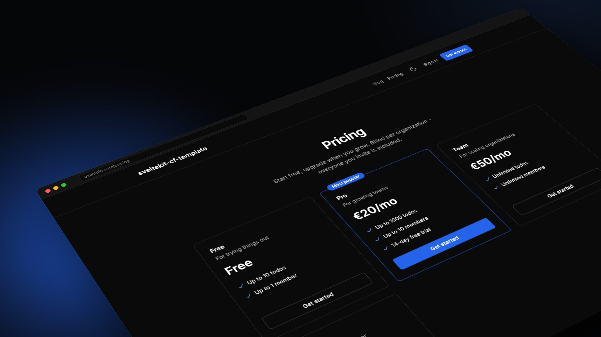
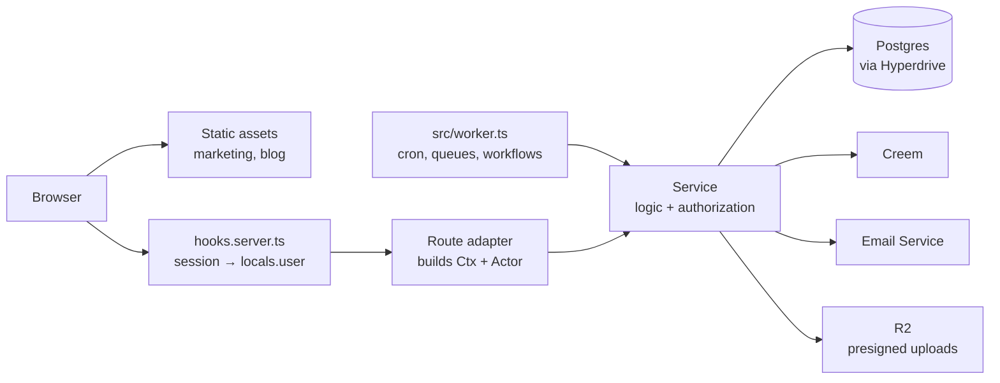

<br />
<p align="center">
    <h1>sveltekit-cf-template</h1>
    <b>A production-ready SaaS template for SvelteKit on Cloudflare Workers. Auth, organizations, billing, email and tests are already done right; an AI coding agent builds the rest in the right place.</b>
    <br />
    <br />
</p>

English | [Italiano](README-IT.md)

sveltekit-cf-template is the part of a SaaS that is hard to get right and tedious to rebuild: a real auth boundary, organizations with role-based permissions, Merchant-of-Record billing with idempotent webhooks, layered rate limiting, transactional email, consent-gated analytics, tests that run in the real Workers runtime, and CI with gated deploys.

It is also a setup an AI coding agent can drive. [AGENTS.md](AGENTS.md) states the architectural invariants, `docs/` explains every subsystem, and the skills in `.agents/skills/` walk the agent through setup, new features and pricing changes, asking you whenever a decision is genuinely yours to make.

Start a new project with [**Use this template**](https://github.com/lowsbarrel/sveltekit-cf-template/generate) on GitHub.

Table of Contents:

- [Features](#features)
- [Getting Started](#getting-started)
  - [Make it yours](#make-it-yours)
  - [Build with an AI agent](#build-with-an-ai-agent)
  - [Commands](#commands)
  - [Deploy](#deploy)
- [Architecture](#architecture)
- [Documentation](#documentation)
- [Contributing](#contributing)
- [Security](#security)
- [License](#license)

## Features

- **Accounts** - Email and password, magic links, Google OAuth, two-factor (TOTP) and passkeys, email verification, breached-password rejection, and a settings area for profile, avatar, sessions and account deletion.

- **Organizations** - Teams with roles and typed permissions enforced in services, invitations with a public accept flow, an org switcher and first-run onboarding.

- **Multi-tenancy** - Every org-scoped query is isolated in the service layer, with an optional Postgres row-level-security backstop.

- **Billing** - Creem as Merchant of Record, so it remits VAT and sales tax for you. Free and paid tiers, trials, one-time lifetime purchases, per-plan quotas and HMAC-verified, idempotent webhooks.

- **Notifications** - Real-time in-app notifications over SSE: a persistent inbox, toasts and refresh signals.

- **Email** - Cloudflare Email Service with translatable templates for every auth flow, a double opt-in newsletter, and a fallback that logs instead of sending until you configure it.

- **Marketing and content** - Prerendered landing, pricing and legal pages and a Markdown blog, served as static assets with canonical URLs, Open Graph, JSON-LD and a sitemap.

- **Analytics** - PostHog, loaded only after the visitor accepts the consent banner, plus first-party server-side events.

- **Background work** - Cron, queues and durable Workflows as ready seams, with a live-progress SSE pattern.

- **Release safety** - Per-PR Worker Previews, feature flags with gradual rollout, versioned rollback, nightly encrypted off-provider backups, and account erasure that survives a restore.

- **Tests and CI** - Server tests inside the Workers runtime against real Postgres, component tests in Chromium, Playwright end-to-end tests, a portability build on plain Node, and a post-deploy smoke test.

## Getting Started

You need Node 24 or later, Bun (the version is pinned in `app/package.json`) and Docker for the local database. A Cloudflare account is needed only to deploy.

```bash
git clone https://github.com/lowsbarrel/sveltekit-cf-template.git my-app
cd my-app/app
bun install
bun run db:up
bun run db:migrate
bun run dev
```

The app runs at `http://localhost:5173`. The first `bun run dev` creates `.dev.vars` from `.dev.vars.example`, which sets `EMAIL_DEBUG=true` so magic links and verification emails are printed to the log instead of sent.

Everything lives in `app/`; the repository root holds only documentation, agent skills and CI.

### Make it yours

Two placeholders must be replaced before CI passes on your copy:

1. **`sveltekit-cf-template`**, the identity token, anywhere in `app/package.json`, `app/wrangler.jsonc` and `app/src/` (the site name in `site.ts`, the consent cookie, the sample blog posts). CI searches for it case-insensitively.
2. **`__HYPERDRIVE_ID__`** in `app/wrangler.jsonc`, once you create your Hyperdrive config.

PR previews also need **`__PREVIEW_HYPERDRIVE_ID__`** in the `previews` block of `app/wrangler.jsonc` pointed at a preview Hyperdrive config; CI does not check that one.

The `todos` feature is a worked example of the architecture (schema, actor-scoped service, protected page). Copy its shape, then delete it. [docs/setup.md](docs/setup.md) covers the rest.

### Build with an AI agent

The skills live in `.agents/skills/` and follow the Agent Skills format. In agents that support slash commands, type `/` and the name:

|Skill|What it does|
|---|---|
|`setup`|Interviews you about the product, applies your answers to the codebase, and writes a personal checklist of the accounts to create, the paid plans you actually need (most start free) and the commands to run|
|`add-feature`|Builds a feature end to end: database model, service with authorization, rate limits, validation, UI, translated strings and tests, placed where the architecture expects. It asks you about real product decisions instead of guessing|
|`add-plan`|Adds or changes pricing tiers, limits, trials and entitlement rules; the pricing page and in-app upgrades follow|
|`upgrade-template`|Pulls later template improvements into your project and resolves the conflicts by the rules in [docs/upgrading.md](docs/upgrading.md)|

A pre-commit hook runs the same gate as CI (`lint`, `check`, `check:invariants`, `check:secrets`, `test`), so whatever the agent adds stays consistent with everything already here.

### Commands

Run these from `app/`.

|Command|Action|
|---|---|
|`bun run dev`|Vite dev server with hot reload|
|`bun run preview`|Build and serve in the real Workers runtime|
|`bun run test`|Migrate, then run server tests in workerd and component tests in Chromium|
|`bun run test:e2e`|Playwright against `wrangler dev`|
|`bun run check`|Generate types and run `svelte-check`|
|`bun run lint` / `bun run format`|Prettier and ESLint|
|`bun run db:generate`|Create a migration from schema changes|
|`bun run db:migrate`|Apply migrations (local, or `DATABASE_URL`)|
|`bun run db:studio`|Browse the local database|
|`bun run deploy:rollback`|Roll production back to the previous version|

### Deploy

Merging to `main` deploys: CI migrates the production database, deploys the Worker and smoke-tests the live URL. Pull requests get their own preview URL. The first-time provisioning of Postgres, Hyperdrive, secrets and repository policy is one copy-paste CLI block in [docs/deploy.md](docs/deploy.md).

## Architecture



Identity flows one way: `hooks.server.ts` resolves the session into `locals.user`, the route turns it into an `Actor`, and the service scopes every query by it. Routes are thin adapters; logic and authorization live in `$lib/server/<feature>/service.ts`, so a route cannot forget a permission check. Public pages are prerendered and served from static assets without invoking the Worker.

```
.
├── app/             the SvelteKit project: src/, tests, migrations, scripts, wrangler.jsonc
├── docs/            one page per subsystem, for people and agents
├── .agents/skills/  setup, add-feature, add-plan, upgrade-template
├── .github/         CI, previews, backups, branch ruleset
└── AGENTS.md        the invariants every change follows
```

|Layer|Choice|
|---|---|
|Framework|SvelteKit (Svelte 5 runes) on Workers via `@sveltejs/adapter-cloudflare`|
|Database|Postgres through Hyperdrive: Neon, Supabase, RDS, self-hosted|
|ORM|Drizzle (`postgres.js`, `drizzle-kit` migrations, `drizzle-zod`)|
|Auth|better-auth with the `organization` plugin|
|Billing|Creem (Merchant of Record)|
|i18n|Paraglide JS 2, English only and wired for more|
|Forms|sveltekit-superforms + zod v4|
|Styling|Tailwind CSS v4 + `@lucide/svelte`|
|AI|Vercel AI SDK + `workers-ai-provider` (opt-in)|
|Tests|Vitest (workerd + Chromium), fast-check, Playwright|

## Documentation

Every page is written for both you and the agent, and checked against the code.

|Doc|What's inside|
|---|---|
|[setup.md](docs/setup.md)|Zero to running app to deployed|
|[architecture.md](docs/architecture.md)|Repository layout, the Ctx/Actor pattern, errors, scripts|
|[adding-features.md](docs/adding-features.md)|The recipe: model, service, route, UI, tests|
|[database.md](docs/database.md)|Hyperdrive caching, migrations, Neon, money types|
|[auth.md](docs/auth.md)|Sign-in methods, organizations and permissions, email|
|[accounts.md](docs/accounts.md)|Settings, avatars, invites, onboarding, deletion|
|[multi-tenancy.md](docs/multi-tenancy.md)|Org as tenant, app-layer isolation, RLS|
|[billing.md](docs/billing.md) · [plans.md](docs/plans.md)|Creem, webhooks, tiers, trials, quotas|
|[notifications.md](docs/notifications.md) · [streaming.md](docs/streaming.md) · [realtime.md](docs/realtime.md)|SSE, reconnects, the WebSocket sidecar|
|[cloudflare.md](docs/cloudflare.md)|KV, R2, cron, queues, workflows, AI, debugging|
|[blog.md](docs/blog.md) · [newsletter.md](docs/newsletter.md) · [analytics.md](docs/analytics.md)|Content, double opt-in, consent-gated PostHog|
|[i18n.md](docs/i18n.md) · [ui.md](docs/ui.md)|Paraglide, the component kit, styling rules|
|[testing.md](docs/testing.md)|The test layers and how to write each|
|[security.md](docs/security.md) · [ai-compliance.md](docs/ai-compliance.md)|Every defense, and AI transparency duties|
|[deploy.md](docs/deploy.md) · [flags.md](docs/flags.md) · [backups.md](docs/backups.md)|Provisioning, CI, flags, rollback, backups|
|[upgrading.md](docs/upgrading.md)|Pulling later template improvements into your project|

## Contributing

Contributions are welcome. Work on a branch off `main` and open a pull request: CI checks Conventional Commit titles, then runs the invariant and secret checks, lint, types, tests, a build with a bundle-size guardrail, end-to-end tests, a plain-Node portability build and a dependency audit. [AGENTS.md](AGENTS.md) describes how the code is organised and what "done" means.

## Security

- Authorization lives in services, never routes, and organization roles are always loaded from the database rather than trusted from the client.
- Auth endpoints are rate limited, no form reveals whether an email has an account, and passwords found in known breaches are rejected.
- Unexpected errors return only a correlation id, and security headers cover both Worker responses and static assets.
- Secrets live in `.dev.vars` locally and in `wrangler secret put` in production; `check:secrets` blocks committed credentials, and new npm releases wait a week before Bun installs them.

Please report vulnerabilities privately through a [GitHub security advisory](https://github.com/lowsbarrel/sveltekit-cf-template/security/advisories/new) rather than a public issue.

## License

This repository is available under the [MIT License](LICENSE).
